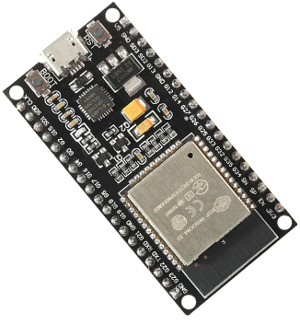
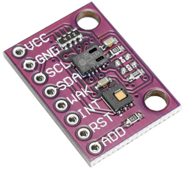
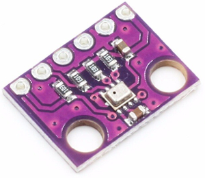

# Air quality monitor

## What

A simple, basic and complete exercise in style to create a cheap smart indoor air quality monitor.

## Why

For funny. For study. For hobby.

To create a DIY IoT air quality monitor.

### TL;DR

I am a pure software developer (Java, C#, Typescript, etc...), so I have never learned how electronic stuff works.

Arduino, Raspberry, GPIO, chip, sensor, micro-controllers, ...? :confused: Theese are only a few examples of unknown words for me.

So, I have started this project to understand/learn theese new and "futuristic" technologies. 
I know, definig Raspberry a futuristic stuff, is same as saying  I'm old... :sweat_smile:

## How

As a software developer, hardware was the challange.

I've  select __Raspberry Pi__ instead of Arduino or other micro-controllers because it is well supported by a big community and it has a steep learning curve for an electronic outsider (and in case of failure it can be recycled as a mame console, multimedia box, nas, ....).

I've been reccomanded to choose the __I2C__ devices by a colleague, who said: "they are well documented and there are a lot out-of-the-box libraries ready-to-use". :+1: I trusted him.

## Hardware

- ESP32 => x1 

- CO2/Temperature/TVOC sensor => x2 => CCS811-HDC1080

- Temperature/Humidity => x1 => DHT11 

- Temperature/Pressure sensor => x1 => BMP280 

- Jumper Wires

Every component is available in the most popular eCommerce services, such as Amazon and AliExpress.

## Software

We have 3 players in this procjet:
- cloud :cloud:
- a device :pager:
- you :angry:

So, you can split it in 3 parts, one for each usage:
- [Cloud functions](cloud-functions/README.md): [Firebase](https://en.wikipedia.org/wiki/Firebase) function written in Typescript using [NodeJS](https://en.wikipedia.org/wiki/Node.js)
- Device Loop: air data loop written in C/C++ using ArduinoIDE and third part libraries
- [Web Interface](web-interface/README.md): air data interface writtern in [Typescript](https://en.wikipedia.org/wiki/TypeScript) using [React](https://en.wikipedia.org/wiki/React_(web_framework))/[Redux](https://en.wikipedia.org/wiki/Redux_(JavaScript_library))

## Price

These are approximately the prices for each components:

- ESP32: ~ € 3.60
- CCS811-HDC1080: ~ € 8.63
- DHT11: ~ € 0.83
- BMP280: ~ € 0.35
- Jumper Wires: ~ € 1.00
- Firebase Cloud: ~ free

__TOTAL__: € 14.41

Prices may have changed over time.